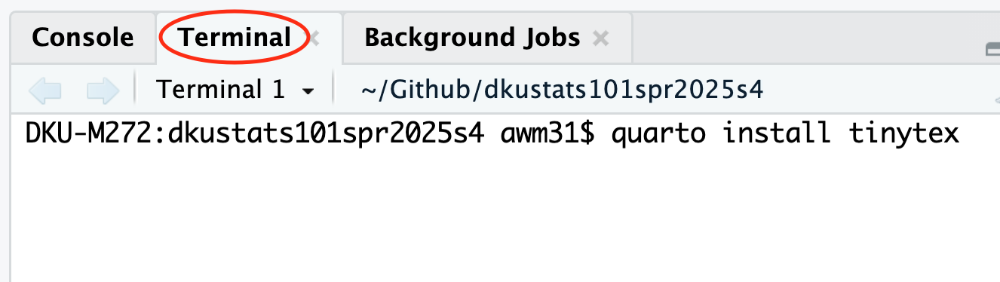

```{r}
#| label: setup
#| include: false

library(tidyverse)
```

# Quarto introduction

Quarto is a document container that allows you to mix text and code to produce reproducible (see [here](https://www.displayr.com/what-is-reproducible-research/) for why reproducibility is important) results and auto-generate high quality document.

## Installing the PDF software

To install the software ([](https://www.latex-project.org/)) that will allow you to create PDF documents, you will need to enter the following line of code in the Terminal window (**not** the Console window):

```         
quarto install tinytex
```



# Practicing with Quarto

To complete this lab, please do a simple investigation into the distribution of `mpg` (miles per gallon) and `wt` (weight) from the `mtcars` built-in dataset.

1.  Select File-\>New Quarto Document
2.  Create a setup block of code
3.  Insert a code block and then make a histogram of `mpg`
4.  Add some text that describes the three features of the `mpg` distribution (shape, center, spread)
5.  Repeat for the variable `wt`
6.  Add appropriate headers for each section and make sure you can navigate between them using the navigation windows
7.  Write a brief conclusion of your investigation

A few additional tips to help you along:

## Editing your document

RStudio has two views for editing your document, `Source` and `Visual`.


Most people find it easier to edit using the Visual mode. Switch back and forth between the two views to check the differences.

Note that at the top of your document is a special section that defines important attributes of how your document will render.


These options are contained within a set of --- charcters. This section must be at the top of your document. *You cannot put code in this section and it must always be at the top of your document. It is a document header that defines how the document will Render*

-   Using the list of options [here](https://quarto.org/docs/reference/formats/html.html), add a subtitle and abstract to rendering options block.

## Insert code block

In particular, you will need to use the Insert a new code chunk button to add a code block


Note that you can only put code between the

```` ``` ````

and

```` ``` ````

parts, text describing the results need to go outside of that block.

### The setup block

It is best practice to insert a code block at the top of the document (just below the header) that contains any code you want to run first. I usually call this the setup code block. In this code block you will load any libraries needed to run the code in your document as well as do any other setup work.

*Note: do not put install libraries commands in your code blocks. You only need to install libraries once - if you put the install code in your document you will force RStudio to re-download and install the library each time you render the document.*

A good code block for the setup looks like this:


> Add a setup block at the top of your document and load the `tidyverse` library in the code block

### Code blocks

You can modify how a code block will render by defining options in the code block header. Each line of the code block header starts with

`#| <option>: <value>`

*Note that the spacing here must be exactly as shown*

For example, here is a simple code block to produce a histogram.


In this case, I added the line `#| echo: true` which means that both the code and the results of the code will be printed on the document and added a caption for the histogram.

While you don't need any headers, generally it is best practice to label each of your code blocks so it is easy to move around your document and find where you wrote each section of code.

> Create two code blocks in your sample document, one that produces a histogram of the variable `mpg` and the other that finds the mean of `mpg` (you can use the following code example below). Label these two blocks and your setup block.

```         
mtcars %>% 
  summarise(mean_mpg = mean(mpg))
```

### Executing your code

There are two ways of executing your code, one by clicking on the Render button and the other by clicking on the green triangle button to the right of your code.

-   Clicking on the Render button will start a new session with all the variables reset and render your document starting at the first code block, going all the way to the end (unless there is an error, in which case it will stop)


-   Clicking on the green triangle will execute only the code in the code block. This can be useful to quickly check if your code works. However, it can be dangerous because the result of clicking on the triangle may refer back a variable that you have previously deleted the code for. Also, the preview window of the results of the green triangle can be unreliable for showing formatting and table structure.


I consider it best practice to use the Render button regularly to make sure your document will work at submission time and display the way you prefer. Relying on the green triangle method of checking your code should be used sparingly.

> Click Render and verify your document will produce the desired outcome.

## Captioning your graphs and tables

Quarto has a special way to label figures and tables, you can see the method to label figures [here](https://quarto.org/docs/authoring/figures.html) and tables [here](https://quarto.org/docs/authoring/tables.html). In particular for code chunks that have figures, the label should start with `#| label: fig-`, so for our example above it should be something like `#| label: fig-mtcarswt`.

You can then add a new code chunk option below the label called `fig-cap` that will caption your figure. Such as `#| fig-cap: "Histogram of variable: MPG"` in the example from the previous section.

> Add a figure label and figure caption to your code chunks

You can even have multiple captions if you have multiple figures in your code chunk.

> Following the pattern [here](https://quarto.org/docs/authoring/figures.html#subcaptions), add a second histogram of `mtcars$mpg` but change the binwidth to your code chunk and create subcaptions for each of the two plots according to the example on the webpage.

> Note that tables work much the same way as figures in terms of labeling. Make sure to pay attention to this labeling on your homework!

## Repeating the exercise for the variable `wt`

Now repeat the calculations above for the variable `wt` - display the shape of the distribution via the `hist()` function and describe the other two features of the data by calculating the mean and the sd in new code blocks. Write a few sentences interpreting your results.

## Navigating your document

You can navigate your document one of two ways. The first way to navigate the document is via the Outline window on the right hand side of the document.


To make your document navigable, it is important to specify headings for each of your document sections via the Style menu.


You can also navigate your document by using the menu at the bottom left, which will also let you jump to specific code blocks. This is why it is important to name your code blocks.


> Add some headers of the appropriate type to your document and double check you can navigate around your document

### Test Header

## Finishing up

Once you've done that, please show me your result and then you can proceed to this website [Computations](https://quarto.org/docs/get-started/computations/rstudio.html) tutorial. Please try to modify your document according to the exercises on the tutorial webpage until the end of class.
