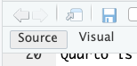
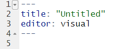
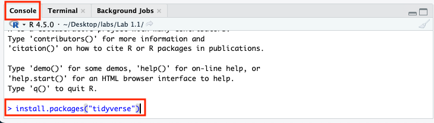
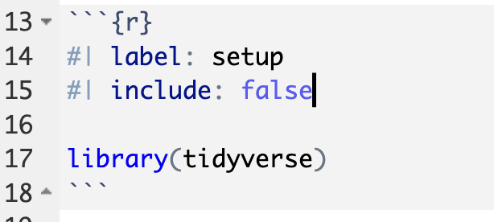
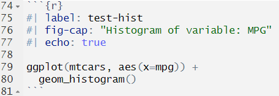
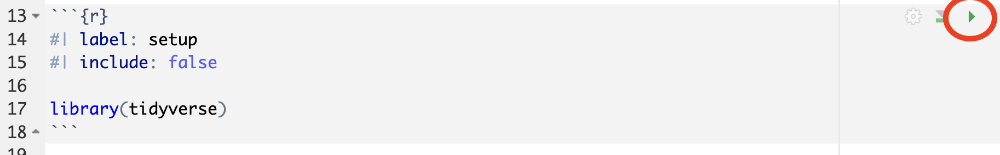
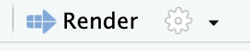
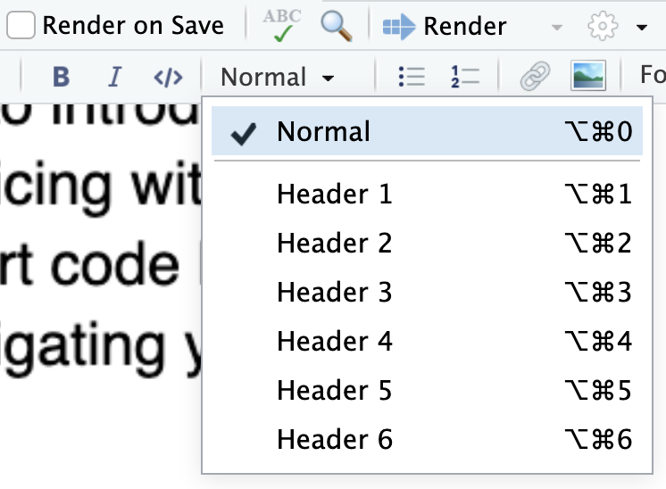
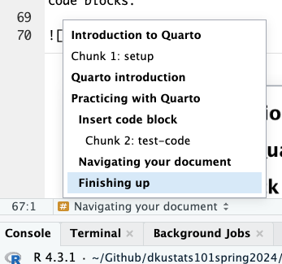

```{r}
#| label: setup
#| include: false

library(tidyverse)
```

Before getting started, load the `dkustats101` package in the Console and copy the Lab 1.1 materials:

```r
library(dkustats101)

use_lab("1.1")
```

If you have not yet installed or updated the `dkustats101` package, please follow the instructions posted on Teams.

# Quarto introduction

Quarto is a document container that allows you to mix text and code to produce reproducible (see [here](https://www.displayr.com/what-is-reproducible-research/) for why reproducibility is important) results and auto-generate high quality document.

# Practicing with Quarto

To complete this lab, please do a simple investigation into the distribution of `mpg` (miles per gallon) and `wt` (weight) from the `mtcars` built-in dataset.

1.  Select File \> New File \> Quarto Document, and choose HTML as the output format
2.  Create a setup code block.
3.  Insert a code block and make a histogram of `mpg`
4.  Add some text that describes the three features of the `mpg` distribution (shape, center, spread)
5.  Repeat for the variable `wt`
6.  Add appropriate section headings and make sure you can navigate between sections using the navigation tools in RStudio
7.  Write a brief conclusion of your investigation

A few additional tips to help you along:

## Editing your document

RStudio has two views for editing your document, `Source` and `Visual`.



Most people find it easier to edit using the Visual mode. Switch back and forth between the two views to check the differences.

Note that at the top of your document is a special section that defines important attributes of how your document will render.



This section is called the YAML header. It is contained between two sets of three dashes (`---`) and must always be at the top of your document. You cannot put R code in this section. The YAML header defines information and options for your document, such as the title, author, and output format.

> Using the list of options [here](https://quarto.org/docs/reference/formats/html.html), add a subtitle and abstract to the YAML header.

## Insert a code block

You will need to use the **Insert a new code chunk** button to add a code block to your document.


In Visual mode, RStudio displays the code block as a separate area where you can enter and run R code. In Source mode, the same code block is enclosed by three backticks, with `{r}` indicating that the block contains R code.

```{r}

```

Only R code should go inside the code block. Text describing or interpreting your results should go outside of the code block.

### Installing packages

Before using a package for the first time, you need to install it. If you have not installed `tidyverse` before, enter the following command in the **Console**:



You only need to install a package once. Do not put package installation commands inside your Quarto document.

### The setup block

It is best practice to insert a code block at the top of the document, just below the header, that contains any code you want to run first. I usually call this the setup code block. In this code block, you will load any packages needed to run the code in your document, as well as include any other setup work.

A good setup code block looks like this:



> Add a setup block at the top of your document and load the `tidyverse` package in the code block.

### Code blocks

You can modify how a code block will render by defining options at the top of the code block. Each option starts with

`#| <option>: <value>`

*Note that the spacing here must be exactly as shown*

For example, here is a simple code block to produce a histogram.



In this example, the line `#| echo: true` means that both the code and the results will be displayed in the rendered document. The code block also includes a caption for the histogram.

While labels are not required for every code block, generally it is best practice to label your code blocks so that they are easier to identify and navigate within your document.

> Create two code blocks in your sample document, one that produces a histogram of the variable `mpg` and the other that finds the mean of `mpg` (you can use the following code example below). Label these two blocks and your setup block.

```         
mtcars %>% 
  summarise(mean_mpg = mean(mpg))
```

## Running and rendering your document

There are two main ways to execute code in a Quarto document.

### Run an individual code block

Click the green triangle beside a code block to run only that block. This is useful when testing or revising a small section of code.

The block runs in your current R session, so it may use objects that were created earlier in the Console or in previously run code block.



### Render the complete document

Click **Render** to run the document from beginning to end and generate the HTML output.

Rendering the complete document confirms that all necessary code is included and that the analysis can be reproduced from a fresh R session.



I consider it best practice to use the Render button regularly to make sure your document will work at submission time and display the way you prefer. Relying on the green triangle method of checking your code should be used sparingly.

> Click Render and confirm that your HTML document opens successfully.

## Captioning your graphs and tables

Quarto has a special way to label figures and tables, you can see the method to label figures [here](https://quarto.org/docs/authoring/figures.html) and tables [here](https://quarto.org/docs/authoring/tables.html).

For code blocks that produce figures, the label should start with `#| label: fig-`. For example: `#| label: fig-mtcarswt`

You can then add another code block option below the label called `fig-cap` to provide a caption for your figure. For example:

`#| fig-cap: "Histogram of variable: MPG"`

> Add a figure label and figure caption to your code chunks

You can also add multiple captions when a code block produces multiple figures.

> Following the pattern [here](https://quarto.org/docs/authoring/figures.html#subcaptions), add a second histogram of `mtcars$mpg` but change the binwidth to your code chunk and create subcaptions for each of the two plots according to the example on the webpage.

> Note that tables are labeled in a similar way to figures. Table labels should begin with `tbl-`. Make sure to use appropriate labels for both figures and tables in your homework!

## Repeating the exercise for the variable `wt`

Now repeat the analysis above for the variable `wt`. Create a histogram to display the shape of the distribution, and calculate the mean and standard deviation in new code blocks to describe its center and spread. Write a few sentences interpreting your results.

## Navigating your document

You can navigate your document in two ways. The first is through the Outline pane on the right-hand side of the document.


To make your document easier to navigate, use the Style menu to assign appropriate headings to each section of your document.



You can also use the navigation menu at the bottom left, which allows you to jump to specific code blocks. This is why it is helpful to label your code blocks.



> Add appropriate headings to your document and double-check that you can navigate between sections.

For example, a level 3 heading in Source mode looks like:

`### Example Heading`

## Finishing up

Once you've done that, please show me your result. Then proceed to the [Computations](https://quarto.org/docs/get-started/computations/rstudio.html) tutorial and modify your document according to the exercises on the tutorial webpage until the end of class.
