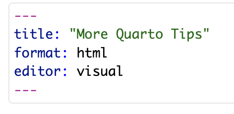
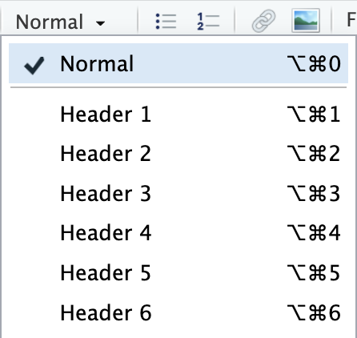
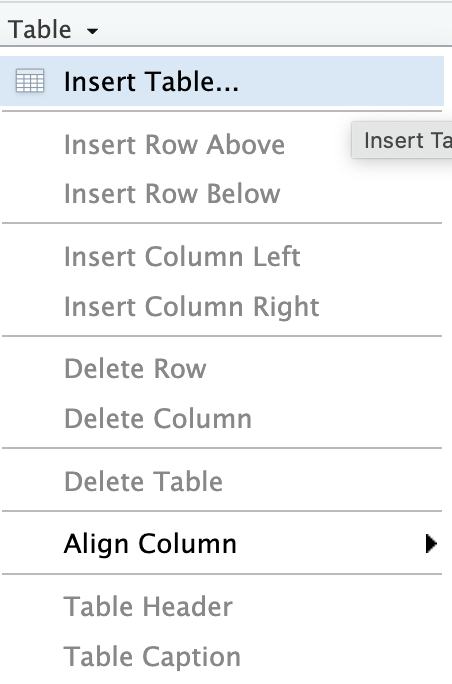

```{r}
#| label: setup
#| include: false

library(knitr)
library(kableExtra)
```

For this lab, first load the `dkustats101` package in the Console and copy the Lab 1.2 materials:

``` r
library(dkustats101)

use_lab("1.2")
```

Next, create a new Quarto document in RStudio by selecting `File -> New File -> Quarto Document...`. Give your document a clear and informative name, and save it inside your Lab 1.2 folder.

## Quarto document structure

In the previous lab, you created and rendered a Quarto document. In this lab, we will take a closer look at how a Quarto document is structured and how you can customize some of its settings.

### Header information

At the top of every Quarto document is a YAML header. The YAML header begins and ends with three dashed lines (`---`) and contains information about the document, such as its title, output format, and editor mode. It should look something like this:



**The YAML header should always remain at the top of the document.**

The settings in the YAML header control the overall format and appearance of the rendered document. You will usually only need to make small changes to this section, such as adding your name, the date, or additional formatting options.

When rendering to HTML, you can also use `embed-resources: true` to create a self-contained HTML file. This embeds resources such as images into the HTML file, which is especially useful when submitting or sharing your rendered document.

For example:

``` yaml
format:
  html:
    toc: true
    embed-resources: true
```

A full list of HTML formatting options can be found [here](https://quarto.org/docs/reference/formats/html.html), with additional examples [here](https://quarto.org/docs/get-started/authoring/rstudio.html).

> Add yourself as the author of the document and add a table of contents using `toc: true`. Also add `embed-resources: true` under the HTML format options so that your rendered document is self-contained. Render the document and verify that your changes work.

### Setup code chunk

Just below the YAML header, you will usually find a setup code chunk. This chunk is used to load the libraries and datasets that you will need throughout the document. Because the setup chunk is run when the document renders, you only need to load each library once rather than repeating `library()` in every code chunk.

In this document, a setup code chunk has already been created for you. Locate the chunk labeled `setup` near the top of the document.

> In the setup code chunk, add `library(tidyverse)` to load the `tidyverse` package. Then import the `mcdonalds.csv` dataset using:
>
> ``` r
> mcdonalds <- read.csv("mcdonalds.csv")
> ```
>
> Render the document to make sure the package loads and the dataset is imported successfully.

### Headings

In the previous lab, you used headings to organize your document and make it easier to navigate. Headings also create a clear hierarchy within a document, helping readers understand how different sections relate to one another.

In the Visual Editor, you can select text and use the formatting menu to assign a heading level. Header 1 is the highest-level heading, while Header 2, Header 3, and so on are used for increasingly specific sections, as shown below:



For our brief investigation today, we are going to examine:

-   Investigation of sodium
-   Describing sodium
-   The distribution of sodium
-   High sodium items
-   Comparing sodium and calories

> Organize the investigation above using appropriate Header 1, Header 2, and Header 3 levels. Think about which title describes the overall investigation, which topics are major sections, and which belong as subsections. Render the document and check that the hierarchy is clearly visible in the rendered output.

## Code chunk options

### Labeling

Code chunks can include chunk options that control how the code and its output behave when the document is rendered. Chunk options begin with `#|` and are placed at the top of a code chunk.

One useful option is `label`, which gives a code chunk a unique name. For example:

`#| label: question3-answer`

Each code chunk should have its own unique label. **If two code chunks share the same label, Quarto will return an error when you render the document.**

Take a look at the setup code chunk near the top of this document. It has already been labeled:

`#| label: setup`

Code chunks that produce figures or tables use a special naming convention. Figure labels should begin with `fig-`, while table labels should begin with `tbl-`. For example:

-   `#| label: fig-somename`
-   `#| label: tbl-somename`

For figures, you can also use additional chunk options to control features such as the caption, alternative text, width, and height. The example below shows several commonly used figure options:


> Under the The distribution of sodium section, create a new code chunk and make a histogram of `sodium`. Give the code chunk an appropriate label using the `fig-` prefix and add a caption using the `fig-cap` option. Render your document and check that the figure and its caption appear correctly.

### Choosing what to display

When you click **Render**, Quarto generates a document that includes your written content along with the results produced by your code chunks. By default, the code itself is also displayed in the rendered document.

You should be able to see this in your sodium histogram: the R code used to create the histogram appears directly above the figure.

If you want the output to appear but do not want to show the code that produced it, you can use:

`#| echo: false`

> Add `#| echo: false` to your sodium histogram code chunk and render the document. Verify that the histogram still appears but the code is now hidden.

Some code chunks may also produce warnings or messages when they run. These can be useful while you are working and debugging, but you may not want them to appear in a finished document.

You can control these using:

-   `#| warning: false` to hide warnings
-   `#| message: false` to hide messages

These options hide the warnings or messages without hiding the actual output of the code chunk.

> Add `#| warning: false` and `#| message: false` to your sodium histogram code chunk. Render the document again and make sure the histogram still appears normally.

Sometimes you may want to run a code chunk without displaying either the code or any of its output. For this, you can use:

`#| include: false`

Take another look at the `setup` code chunk near the top of this document. It already contains `#| include: false`. This allows the setup code to run when the document is rendered without displaying the code or its output in the final document.

## Making tables

### Inserting a basic table

You can create a simple table directly in the Visual Editor. To insert a table, use the Table option in the Insert menu, as shown below:



After selecting Table, choose the number of rows and columns you would like to include.


> In the Comparing sodium and calories section of the document, insert a table with two rows and three columns. Add the caption `Summary comparison between sodium and calories`.

Tables created this way are useful when you want to present simple information directly in your document. You can also use inline R code inside a table cell to insert values calculated by R.

Inline R code begins with `` `r `` and ends with a backtick. For example:

`` `r 1+1` ``

When the document is rendered, R will calculate the expression and display the result instead of the code.

You can replace `1+1` with a more useful calculation. For example:

`` `r mean(mtcars$mpg)` ``

This calculates the mean of `mpg` and inserts the result directly into the rendered table.

> In the table you created, use inline R code to calculate the mean of sodium and calories in the first row and the standard deviation of both variables in the second row. Render the document and verify that the calculated values appear correctly in the table.

### Making a table programmatically

For larger or more complex tables, it is usually easier to create the table directly from your data using R rather than entering the values by hand.

One useful function for this is `kable()` from the `knitr` package (documentation [here](https://bookdown.org/yihui/rmarkdown-cookbook/kable.html)). You can pass any data frame to `kable()` and R will format it as a table in the rendered document.

For example:

`kable(mtcars)`

The `knitr` package has already been loaded in the setup code chunk. If `knitr` is not installed in your R environment, install it by running the following command in the Console:

`install.packages("knitr")`

> In the High sodium items section, filter the `mcdonalds` dataset to show only items with sodium greater than 1000. Then use `kable()` to display the filtered data as a table. Remember to give the code chunk an appropriate label using the `tbl-` prefix. Render the document and verify that the table appears correctly.

`kable()` tables can be further customized using the `kableExtra` package (documentation [here](https://cran.r-project.org/web/packages/kableExtra/vignettes/awesome_table_in_html.html)).

If `kableExtra` is not installed in your R environment, install it by running the following command in the Console:

`install.packages("kableExtra")`

The `kableExtra` package has already been loaded in the setup code chunk, so once it is installed you can use its functions directly.

For example, you can add `kable_styling()` to a table using a pipe:

``` r
kable(mtcars) %>%
  kable_styling()
```

You can use additional kableExtra options to further customize the appearance of the table.

> Now modify your High sodium items table using kable_styling() and explore some of the available kableExtra options to improve its appearance. Render the document and verify that your changes appear correctly.

## Additional investigations

If you've made it this far, good job! Use the remaining lab time to further explore the `mcdonalds` dataset. Choose another variable or relationship to investigate, and add appropriate headings, code chunks, plots, summary statistics, or tables to your document.
